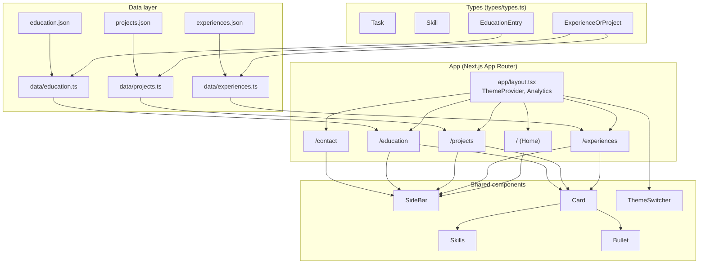
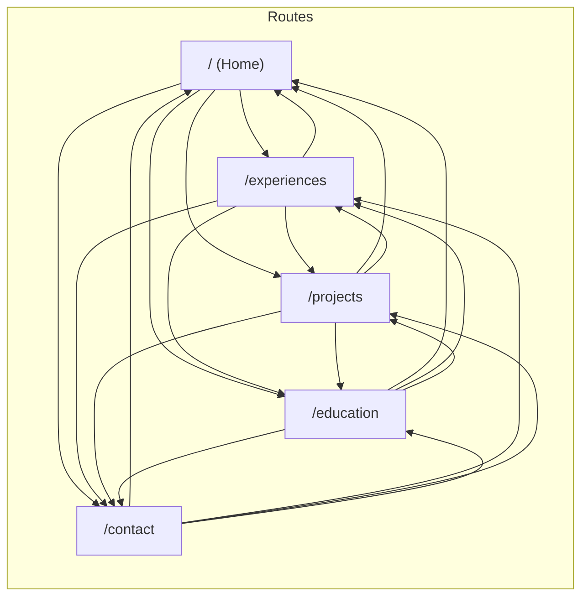

# Jialin Portfolio — Project Diagram

## App structure & data flow



## Routes & navigation



## Type & data relationships

```mermaid
erDiagram
  ExperienceOrProject {
    number id
    string title
    string company
    string dates
    Task[] tasks
    Skill skills
  }
  Task {
    number id
    string description
  }
  Skill {
    string[] Languages
    string[] Frontend
    string[] Backend
    string[] "Cloud Platforms"
    string[] "DevOps & Tools"
    string[] Methodologies
  }
  EducationEntry {
    number id
    string institution
    string degree
    string dates
    string logo
  }
  ExperienceOrProject ||--o{ Task : has
  ExperienceOrProject ||--o| Skill : has
```

## Page → component usage

| Page        | Data source        | Components used                          |
|------------|--------------------|------------------------------------------|
| Home       | —                  | SideBar, Image, Link                     |
| Experiences| `data/experiences` | SideBar, Card (→ Skills, Bullet)         |
| Projects   | `data/projects`    | SideBar, Card (→ Skills, Bullet)         |
| Education  | `data/education`   | SideBar, article (no Card)               |
| Contact    | —                  | SideBar, ContactForm (react-hook-form)  |
